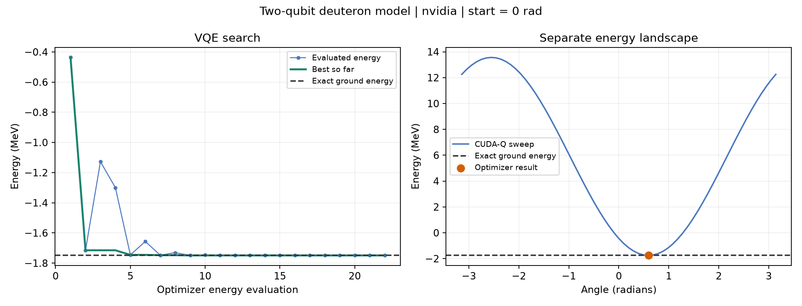

# VQE practice: find the ground energy of a two-qubit model

A runnable Variational Quantum Eigensolver (VQE) exercise using CUDA-Q to
evaluate a parameterized circuit and SciPy's COBYLA optimizer to choose the
next angle. It uses NVIDIA's small deuteron example, which is easy to check
independently with a 4-by-4 matrix.

This is personal learning material in a CUDA-Q fork. The supplied validation
records come from assistant-executed checks, not a record of completed learner
exercises.

## Setup and run

Use Python 3.12 in Linux or WSL2. From this repository's root, create an
environment and install the versions used for the saved runs:

    cd examples/python/vqe_practice
    python3.12 -m venv .venv
    source .venv/bin/activate
    python -m pip install -r requirements.txt
    python vqe.py

If you already have an environment with these dependencies, activate it and
run the script directly. The default target is the NVIDIA GPU simulator;
a compatible NVIDIA GPU and driver are required.

For the CPU simulator:

    python vqe.py --target qpp-cpu

Change the starting point or limit the search:

    python vqe.py --initial-angle 2.0
    python vqe.py --max-evals 3

The last command deliberately provides too few evaluations. It should report
non-convergence and exit with status 2. A validated run exits with status 0.
The program retains diagnostic results in either case.

The commands use an installed CUDA-Q release. They do not build this repository
or validate its unbuilt source revision.

## What the circuit represents

The fixed Hamiltonian is a truncated deuteron model, with coefficients in MeV:

$$
H = 5.907I - 2.1433X_0X_1 - 2.1433Y_0Y_1
    + 0.21829Z_0 - 6.125Z_1.
$$

A deuteron is a proton-neutron bound system. The two qubits encode a small model
space; they are not simply one qubit per particle. The result belongs to this
model and its rounded coefficients, not a precision calculation of the full
physical nucleus.

The circuit in [energy.py](energy.py) is:

    x(q[0])
    ry(theta, q[1])
    x.ctrl(q[1], q[0])

Only the RY angle changes. Writing ket labels as |q0 q1>, the trial state is:

$$
|\psi(\theta)\rangle
= \cos(\theta/2)|10\rangle + \sin(\theta/2)|01\rangle.
$$

CUDA-Q's statevector index order is |00>, |10>, |01>, |11> with those labels:
q0 is the least-significant index bit. The NumPy reference uses the same order.

Each objective evaluation calculates the energy of that state:

$$
E(\theta) = \langle\psi(\theta)|H|\psi(\theta)\rangle.
$$

At zero angle, the state is |10>, so:

$$
E(0) = 5.907 - 0.21829 - 6.125 = -0.43629\ \mathrm{MeV}.
$$

Run the single-energy starter with:

    python energy.py

Its ANGLE constant defaults to 0.0. Edit it to 0.59 to compare two trial
energies. That constant controls only this starter; the full VQE instead uses
its own --initial-angle argument.

## Where the optimization happens

The essential loop in [vqe.py](vqe.py) is:

    def objective(parameters):
        return energy(float(parameters[0]))

    result = minimize(
        objective,
        x0=[initial_angle],
        method="COBYLA",
        options={"rhobeg": 0.5, "tol": 1e-4, "maxiter": max_evaluations},
    )

SciPy repeatedly proposes an angle. CUDA-Q prepares the trial state and returns
its Hamiltonian expectation via cudaq.observe. The circuit is simulated on
the selected target; the optimizer runs classically.

There is **one adjustable angle**, evaluated many times. Comparing two chosen
angles alone is not the full VQE. The feedback loop is what makes this an
iterative optimization.

Each printed row is an objective evaluation, not necessarily an accepted
optimizer step. Some candidates have higher energy and are rejected.
The best-so-far column records the lowest energy observed.

No finite shot count is requested for observe. These simulator results contain
numerical rounding but no finite-shot sampling noise.

## What convergence means here

For this ansatz and Hamiltonian:

$$
E(\theta) = 5.907 - 4.2866\sin(\theta) - 6.34329\cos(\theta).
$$

This sinusoid has equivalent global minima every 2 pi. Its ground state lies
in the real span of |10> and |01>, which the circuit can represent.
General VQE can have other local minima or an ansatz that cannot represent the
ground state. A local optimizer does not guarantee the global minimum.

COBYLA stops when its trust-region radius reaches the configured tolerance,
or when its evaluation budget is exhausted. For this method, maxiter is the
maximum number of objective evaluations. Stopping alone is not proof of finding
the desired energy.

After optimization, the program independently diagonalizes the Hamiltonian
with NumPy and checks:

- The optimizer reports success.
- The final energy agrees with the exact model ground energy within 2e-5 MeV.
- The prepared state has ground-state fidelity greater than 1 - 1e-5.
- A separate 65-angle sweep agrees with the matrix calculation and varies
  with the angle.

The energy tolerance accommodates default GPU numerical precision. The exact
answer and the later sweep are never given to the optimizer.

## Outputs and verified examples

Every run creates a new results directory beside the script containing:

- optimization_trace.csv: optimizer evaluations and best energy so far.
- energy_sweep.csv: the separate 65-angle landscape, evaluated afterward.
- result.json: settings, versions, stop reason, numerical checks, and hashes.
- convergence.png and convergence.svg: the search and separate landscape.

The sweep is for visualization and validation. Its evaluations are separate
from the optimizer's evaluation count.

See [VALIDATION.md](VALIDATION.md) for executed commands and saved evidence.
Fresh run directories are ignored by Git; selected validation records are
kept under [recorded_runs](recorded_runs/).

## Try it yourself

- [ ] Run the single-energy starter and check the zero-angle energy by hand.
- [ ] Compare the energy at 0.0 and 0.59 radians.
- [ ] Run the VQE and explain its evaluation trace and stop reason.
- [ ] Start at 2.0 radians and compare the path and final energy.
- [ ] Limit the budget to 3 evaluations and inspect the failure record.
- [ ] Explain why the exact matrix check is separate from the optimizer.
- [ ] Identify what would change for a larger model or finite-shot estimates.

## References

- [NVIDIA's optimizer integration example][nvidia-optimizer]
- [NVIDIA's two-qubit model and circuit][nvidia-model]
- [SciPy's COBYLA settings and stopping conditions][scipy-cobyla]
- [Qiskit Nature's deuteron model background and units][deuteron-background]

The model and circuit follow NVIDIA's example. This practice adds a visible
optimization trace, an independent matrix comparison, a separate landscape,
and saved validation artifacts.

[nvidia-optimizer]: https://nvidia.github.io/cuda-quantum/latest/examples/python/optimizers_gradients.html
[nvidia-model]: https://nvidia.github.io/cuda-quantum/latest/specification/cudaq/examples.html#deuteron-binding-energy-parameter-sweep
[scipy-cobyla]: https://docs.scipy.org/doc/scipy/reference/optimize.minimize-cobyla.html
[deuteron-background]: https://qiskit-community.github.io/qiskit-nature/tutorials/12_deuteron_binding_energy.html
